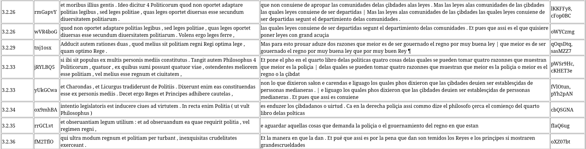

# Concordancier multilingue pour l'étude de traductions

Cet outil produit des concordances multilingues à partir de corpus structurés en XML-TEI, alignés au segment et annotés lexicalement. 
Il est pensé pour faciliter l'étude quantitative et qualitative de corpus de traductions.

Des tables de concordance au format HTML sont produites pour chaque requête à partir d'un texte cible ou d'un texte source.

## Structure des fichiers d'entrée

L'outil fonctionne actuellement sur des corpus binaire source/cible. Il requiert deux fichiers TEI préalablement alignés.
L'unité d'alignement, c'est-à-dire l'élément qui contient le segment aligné, doit être indiqué. Par défault, il s'agit de
l'élément `cl` (clause). L'alignement est réalisé par un jeu d'attributs `@xml:id` et `@corresp`. La gestion des alignements 
de `1 > n`, `n > 1` et `n > n` segments est possible.

## Fonctionnement

Peuvent être interrogés les informations formelles (formes), lexicales (lemmes) ou grammaticales (pos, morph), selon une syntaxe CQL basique:

`python3 get_translations.py -s test_data/Val_S.xml  -t  test_data/Rome_W.xml -o new_alignement_2/ -me cl -q "[pos='AQ.*'][pos='NC.*']" -w 1`

Cette commande produit une table de concordance en prenant le texte `Val_S.xml` comme source, avec un contexte de 1 segment à gauche et à droite pour la source et la cible. Elle cherche tous les
adjectifs antéposés au substantif (requêtes sur les étiquettes EAGLES).

## Sortie

Sont produites des tables au format HTML, CSV et LaTeX: 

---

# Multilingual concordancer for translation studies

This tool produces multilingual concordances from corpora structured in XML-TEI, segment-aligned and lexically annotated. 

HTML-formatted concordance tables are produced for each query from target or source text.

## Input file structure

The tool currently works on binary source/target corpora. It requires two pre-aligned TEI files.

The alignment unit, i.e. the element containing the aligned segment, must be specified. The `cl` (clause) is the default element. Alignment must be indicated by a set of `@xml:id` and `@corresp` attributes. 
The tool can manage alignments of `1 > n`, `n > 1` and `n > n` segments.

## How it works

Forms, lemmas, pos and morph can be queried with a basic CQL parser: 

`python3 get_translations.py -s test_data/Val_S.xml  -t  test_data/Rome_W.xml -o new_alignement_2/ -me cl -q "[pos='AQ.*'][pos='NC.*']" -w 1`

This command produces a concordance table taking the text `Val_S.xml` as source, with a context of 1 segment left and right for source and target, and extracts all the segments
with an anteposed adjective.

## Output

HTML, CSV and LaTeX formatted tables are produced: 
